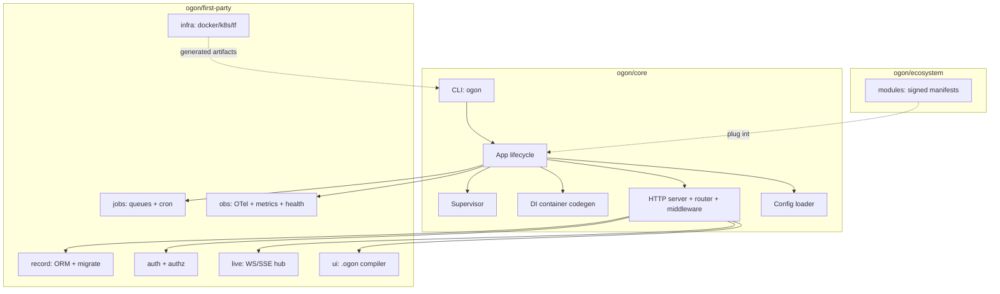
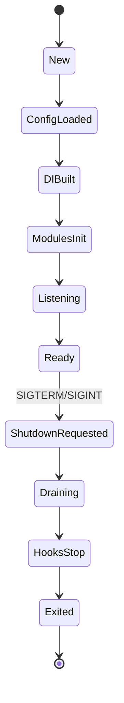

# Architecture overview

> **Goal**: give a developer (or agent) a complete mental model of how
> OgonGo fits together at runtime, so they can debug, extend, and
> reason about it without reading the whole source tree.

This page covers, in order: **what**, **when**, **quickstart**, **config**,
**test**, **prod**, **escape**, **troubleshoot** (DOC-018).

---

## What

OgonGo is a single-binary Go web framework. It is structured as three
concentric tiers:

1. **`ogon/core`** — runtime, HTTP, routing, config, DI, lifecycle,
   CLI. Minimal deps (`net/http`, `log/slog`, `goccy/go-yaml`).
2. **`ogon/first-party`** — `record`, `auth`, `authz`, `jobs`, `live`,
   `ui`, `obs`, `infra`, `cache`, `pubsub`, `test`. Versioned with
   core.
3. **`ogon/ecosystem`** — modules (Part XVI). Independent versioning,
   manifest + compatibility contract.

The runtime supervision model: every goroutine is owned by
`runtime.Supervisor` (Part 0 rule 8). `Supervisor.Spawn(name, task)`
registers the goroutine, captures panics, and is cancelled on
`Supervisor.Stop()`. No leaks.

The lifecycle state machine (Part V.2):

## When

Read this page when:

- you want to know which package owns a behavior before you change it;
- you want to add a new subsystem and need to know where it plugs in;
- you are debugging a boot or shutdown issue and need the state
  machine;
- you are writing an agent and need the runtime model.

## Quickstart

The simplest mental model: **the CLI owns the lifecycle, the App owns
the process, the Supervisor owns the goroutines, the HTTP server owns
the request, the Ctx owns the per-request state.**

1. `ogon new` writes `ogon.yaml`, `go.mod`, `main.go`, `routes/`,
   `models/`, `handlers/`.
2. `ogon dev` runs `ogon build` + watches + restarts. `ogon build`
   runs codegen (DI container, route table, OpenAPI), `gofmt`, then
   `go compile`.
3. At boot, `ogon.Boot(opts)` walks the state machine: New →
   ConfigLoaded → DIBuilt → ModulesInit → Listening → Ready.
4. `App.Run(ctx)` blocks until SIGTERM/SIGINT, then drains in-flight
   requests, runs OnStop hooks, and exits 0.
5. `ogon deploy` runs `ogon build` + `ogon infra gen` + `docker push`
   + `kubectl apply` + `kubectl rollout status` + `ogon health`.

## Config

The config tree (`ogon.yaml`):

| Section     | Owner package      | Notes                                                     |
|-------------|--------------------|-----------------------------------------------------------|
| `project`   | `cli`              | Name, template, version.                                  |
| `http`      | `http`             | Addr, timeouts, TLS.                                      |
| `database`  | `record`           | Driver, url, pool, migrate.                               |
| `auth`      | `auth`             | Session, passkey, rate_limit, lockout.                    |
| `authz`     | `authz`            | RBAC roles, tenant.                                       |
| `jobs`      | `jobs`             | Queues, retry, DLQ, cron.                                 |
| `live`      | `live`             | Hub, presence, backpressure.                              |
| `ui`        | `ui`               | Compiler, runtime, sanitize.                              |
| `obs`       | `obs`              | Log, trace, metrics, health, redaction, pprof.            |
| `infra`     | `infra`            | Docker, k8s, terraform, cloudflare.                       |
| `modules`   | `modules`          | List of installed modules.                                |
| `runtime`   | `runtime/limits`   | GC percent, max_procs, memory_limit.                      |
| `features`  | `cli`              | Feature flags.                                            |

`ogon explain config` walks the tree; `ogon inspect config` shows the
resolved values (with secrets redacted).

## Test

Each subsystem ships with its own table tests + edge tests + fuzz
tests. The `test/` package is the cross-cutting fixture layer. The
`agent-ctx/P*.md` files are the per-phase verification logs.

## Prod

In prod:

- One static binary, distroless Docker image.
- `ogon deploy` ships it.
- `obs/` ships OTel traces + Prometheus metrics + health probes by
  default.
- `infra/` generates the k8s manifests + Terraform.

## Escape

- **Plain Go**: import any package without the CLI.
- **Manual DI**: `BootOpts{Manual: true}`.
- **Custom supervisor**: implement `runtime.Supervisor` and pass it
  to `Boot`.
- **Custom config source**: implement `config.Source` and register
  it.

## Troubleshoot

| Symptom                                | Fix                                                            |
|----------------------------------------|----------------------------------------------------------------|
| Boot hangs at `Listening`              | A start hook is stuck; `ogon inspect runtime` shows the goroutine. |
| `DIBuilt` -> `ModulesInit` fails       | A module's manifest is incompatible; check `modules/`.         |
| `Ready` never reached                  | The readiness gate is failing; `ogon health` shows which probe.|
| Shutdown hangs                         | `drain_timeout` (default 20s) exceeded; force-exit 130.        |

---

Next: [Reference](./reference/index.md), [Cookbook](./cookbook.md).

<!-- MIT License — Copyright (c) 2026 OgonFrameworks. All rights reserved. -->
